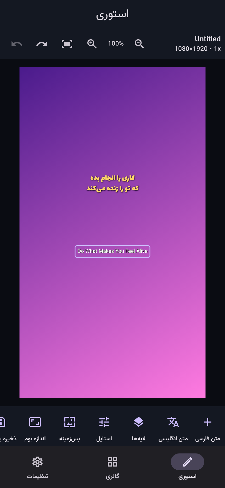

# Fonto Studio

A standalone, offline-first Persian/Arabic **text-on-image story editor** for Android, built with Flutter. Independent design inspired by the Fonto workflow — no proprietary logos or assets are copied.

> Status: **v0.2 — editor redesign**. Story editor, Gallery and Settings are functional. CI builds an installable release APK.



## Features

### Story editor (v0.2)
- **Canvas-first layout** — the document owns the screen; every tool opens in a
  draggable sheet over it instead of permanently stealing height
- **Zoom & pan** (pinch or the toolbar controls) with a live zoom readout and fit-to-screen
- **Layer management** — reorderable stack with per-layer visibility, lock,
  duplicate and delete
- **Aspect ratios** — 9:16, 4:5, 3:4, 1:1, 16:9, 1.91:1, 2:3, plus a free-form custom size
- **High-resolution export** — 1x/2x/3x/4x multiplier (up to 4320×7680 from a story canvas)
- **True transparent PNG** — the checkerboard is drawn outside the export
  boundary, so a transparent background exports with alpha 0 (verified by test)

### Story editor
- Multiple text layers, Persian & English, **RTL / LTR** per layer
- Font picker with search, categories, favorites, recent and **live preview**
- Color, font weight, size, **letter spacing**, line height, alignment
- **Shadow**, **Stroke**, **Gradient fill**, rounded **background box**
- Move / rotate / scale by touch (pinch), plus precise sliders
- Opacity, bring-to-front
- **Undo / Redo** (full-history snapshots)
- Backgrounds: transparent, solid, or gradient; four canvas sizes
- **Save drafts** and reopen them
- **Export transparent PNG** at full document resolution (share sheet)

### Gallery
- Ready-made **backgrounds** and full **templates** that apply to the editor
- Search across items — every item is functional, nothing is a mockup

### Settings
- Language **فارسی / English**, light / dark / system theme
- Workspace accent color
- **Font management**: import your own **TTF/OTF** fonts at runtime

## Fonts & licensing

Bundled families are all **SIL Open Font License (OFL 1.1)**:
Vazirmatn, Shabnam, Sahel, Samim, Lalezar, Noto Sans Arabic, Noto Naskh Arabic.

Commercial families (IRANSans, the B-family, Dana, Morabba, …) are **not** bundled.
Add them yourself via **Settings → Import TTF/OTF font**; nothing unlicensed ships in this repo.

## Architecture

Modular, offline-first:

```
lib/
  core/            settings, theme, strings (fa/en), font catalog
  features/
    story/         models, editor state (undo/redo, export), canvas, inspector
    gallery/       gallery + font-picker + preset data
    settings/      settings screen
  shared/          reusable controls
```

State via `provider` + `ChangeNotifier`. Persistence via `shared_preferences`.

## Building

The `android/` folder is generated in CI (and locally) rather than committed, so
the build always matches the installed Flutter version:

```bash
flutter create --platforms=android --org com.fontostudio --project-name fonto_studio .
flutter pub get
flutter test
flutter build apk --release
```

CI (`.github/workflows/android-build.yml`) runs analyze + test + release build on
`ubuntu-latest` and publishes the APK as the **fonto-studio-release-apk** artifact.
